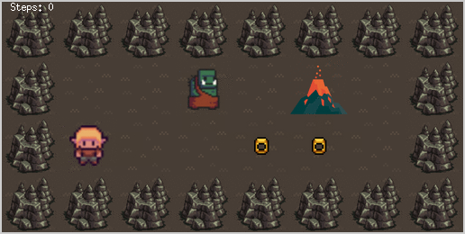

# So_Long_Game
42's So_Long project
<br>
<h2>About</h2>
<p>Objective: Create a basic 2D game in which a dolphin escapes Earth after eating some fish. Instead of a dolphin, fish, and the Earth, you can use any character, any collectible and any place you want.</p>
<h3 align="center">Help Frodo to collect all rings and destroy them in Mount Doom. Be careful with the orcs!</h3>
<p align="center"></p>

## :hammer: How to execute

### Requirements
1. The project is written in C language and thus needs the **`gcc` compiler** and some standard **C libraries** to run.<br>
2. Also, the minilibx library present in this repository is set to run on a linux OS. Therefore, if you don't have it, you will have to install a VM. If you ara a sutudent at 42, you can run it on workspace. Since workspace already have minilibx installed by default, you will have to substitute the makefile present on root with the <a href="./so_long/utils/Makefile" target="_blank">makefile adjusted to run on workspace</a>.
3. If you are running on workspace and you are not on one of 42's local machines, you will have to install VNC. For this project I chose <a href="https://remmina.org/how-to-install-remmina/" target="_blank">Remmina</a>.

### Instructions
  1. Clone this repository on a local folder<br>
  2. To compile the code, enter the folder where the Makefile is present: 

```shell
cd path/to/so_long
```
and run: 
```shell
make
```
or
```shell
make bonus
```

3. Lauch the game with the desired map. For example:

```shell
./so_long_bonus ./maps/bonus_map_small.ber
```
